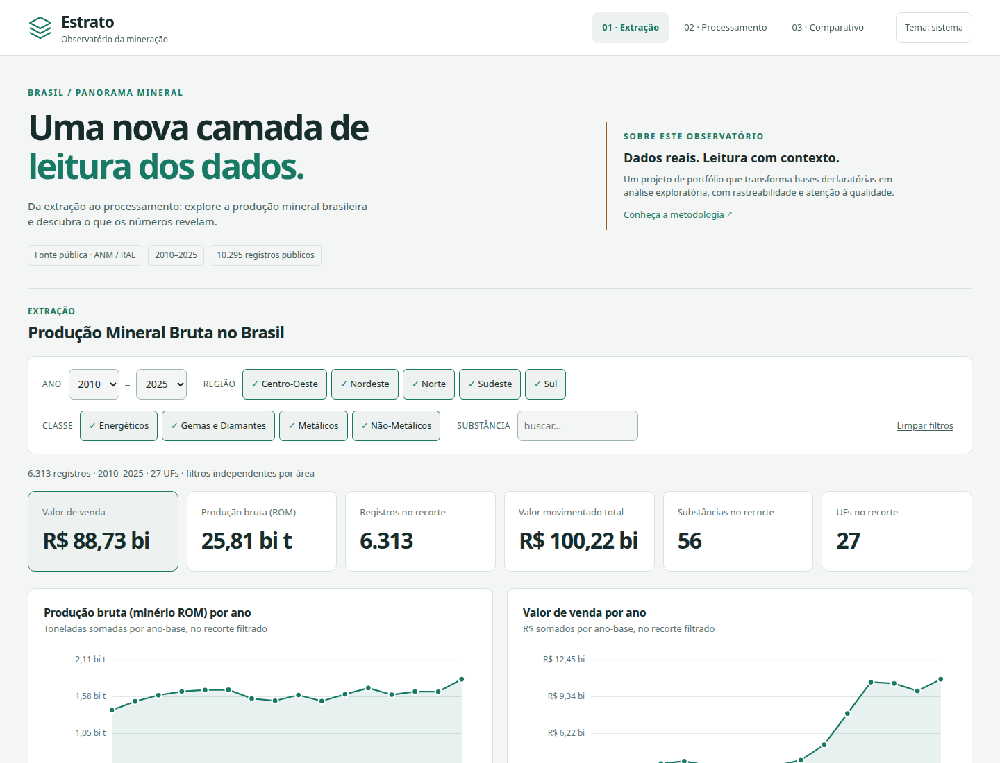
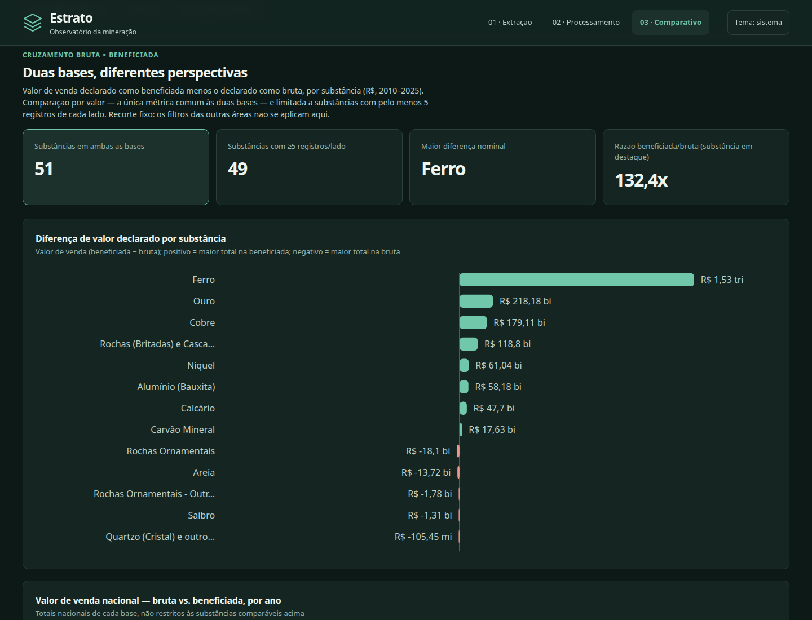
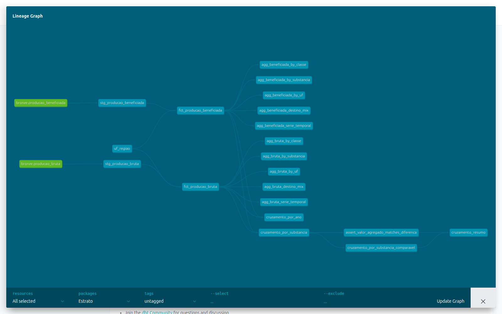
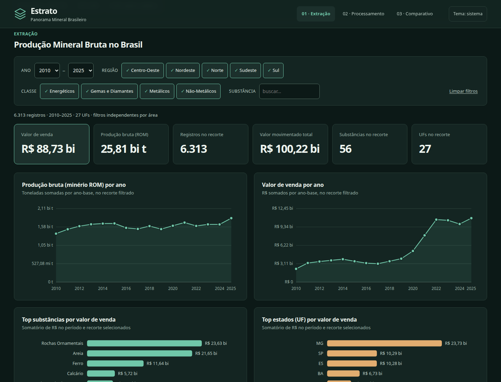
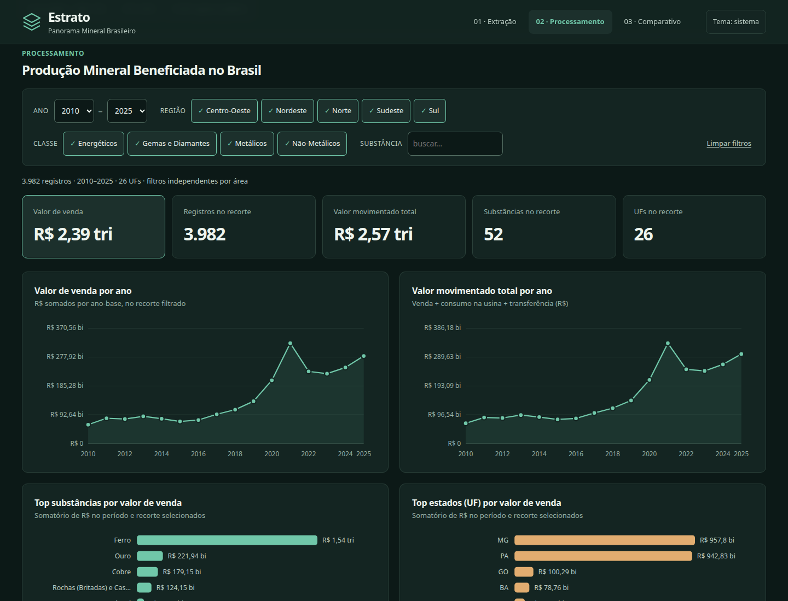

# Estrato Panorama Mineral Brasileiro

Pipeline de analytics engineering que transforma **10.295 registros públicos**
da mineração brasileira em modelos analíticos testados e um dashboard interativo.

**18 modelos dbt · 57 testes de dados · 10 testes Python · dashboard offline**

[Abrir dashboard](https://caio-analytics.github.io/Estrato-Panorama-Mineral-Brasileiro/) ·
[Explorar linhagem dbt](https://caio-analytics.github.io/Estrato-Panorama-Mineral-Brasileiro/dbt/) ·
[Abrir HTML offline](output/dashboard.html) ·
[Decisões de design](docs/design.md)



## O que este projeto demonstra

| Competência | Evidência no projeto |
|---|---|
| Ingestão de dados públicos | Polars lê CSVs `cp1252` e grava Parquet tipado em Bronze |
| Analytics engineering | dbt organiza staging, fatos, agregações e cruzamentos em DuckDB |
| Qualidade e contratos | 57 testes dbt, 10 testes Python e validação de interface em Chromium |
| Análise responsável | Unidades, cobertura e limites de comparabilidade explicitados no produto |
| Entrega de produto | Dashboard responsivo, acessível, sem CDN e publicável como arquivo único |

Estrato conecta camadas geológicas às camadas de transformação dos dados. A
variedade da stack é intencional: o projeto foi estruturado para demonstrar
ingestão, modelagem, testes, documentação e entrega em um fluxo reproduzível.

## Dados e fontes

Os dados são públicos, publicados pela [Agência Nacional de Mineração
(ANM)](https://www.gov.br/anm/pt-br/acesso-a-informacao/dados-abertos/bases-de-dados)
a partir do Relatório Anual de Lavra (RAL). A ANM informa que a série começa no
ano-base 2010, é atualizada à medida que declarações são inseridas, retificadas
ou ajustadas, e pode conter inconsistências por ser declaratória.

Este recorte contém 10.295 registros, de 2010 a 2025, em duas bases:
**Produção Bruta** (o que sai da lavra) e **Produção Beneficiada** (o que sai
da usina, já processado). A página da [Produção Mineral da
ANM](https://www.gov.br/anm/pt-br/assuntos/economia-mineral/producao-mineral)
oferece contexto adicional e painéis oficiais.

## As bases

> **Produção Bruta** — "Dados de produção bruta e respectivas destinações
> (vendas, transferências, consumo e transformação) obtidos a partir do
> Relatório Anual de Lavra (RAL) [...] pode haver inconsistências nas
> informações disponibilizadas, por sua fonte ser dados declaratórios."

> **Produção Beneficiada** — mesma fonte, para o produto já processado.

6.313 registros de produção bruta + 3.982 de produção beneficiada, 56 e 52
substâncias. As duas compartilham UF/Classe/Substância como dimensões, mas
não compartilham unidade: Bruta é sempre em toneladas; Beneficiada varia
por linha (t, kg, ct — diamante em quilates, bauxita em toneladas). Ver
[`transform/models/staging/`](transform/models/staging/).

## Decisões de engenharia

| Decisão | Motivo |
|---|---|
| Polars até Bronze | Os CSVs usam `cp1252` e decimal brasileiro; a fronteira de ingestão preserva os valores como texto antes da tipagem. |
| dbt + DuckDB na transformação | SQL versionado, dependências explícitas por `ref()`, testes, documentação e linhagem em um warehouse local. |
| Parquet entre ingestão e transformação | Separa a leitura dos arquivos-fonte da modelagem analítica e reduz custo de leitura. |
| Dashboard em HTML, CSS, JS e SVG | Entrega portátil, sem servidor ou CDN; filtros e gráficos funcionam no navegador. |
| Playwright no CI | Valida navegação, filtros, teclado, tema e responsividade no artefato final. |

## O que o comparativo permite concluir

O [cruzamento SQL](transform/models/marts/cruzamento/) agrega os valores de
venda declarados por substância nas duas bases. Os totais acumulados são
R$ 88,7 bi na bruta e R$ 2,39 tri na beneficiada (2010–2025).



**As razões entre esses totais não medem o valor adicionado pelo processamento.**
As bases não pareiam operações, empresas ou volumes; cobertura e composição
são diferentes. O critério de cinco registros por lado reduz comparações com
pouca cobertura, mas não estabelece equivalência. Valores são nominais, sem
ajuste pela inflação. Diferenças negativas não demonstram perda econômica.

## Arquitetura

```
data/raw/{Producao_Bruta,Producao_Beneficiada}.csv (cp1252, decimal BR)
        │
        ▼
┌────────────────┐  Polars lê o CSV cp1252, tipa como string, grava Parquet
│  BRONZE (EL)    │  com lineage. dbt não decodifica cp1252, por isso Python.
└───────┬─────────┘
        ▼
┌────────────────┐  dbt lendo o Parquet como fonte externa — parsing de
│  STAGING        │  decimal BR via macro, sentinela → nulo
└───────┬─────────┘
        ▼
┌────────────────┐  seed uf_regiao + colunas derivadas — fct_producao_bruta
│  MARTS: core    │  / beneficiada, uma linha por declaração
└───────┬─────────┘
        ▼
┌────────────────┐  GROUP BY + window functions (LAG p/ YoY) por ano, UF,
│  MARTS: agg     │  substância, classe, mix de destinação
└───────┬─────────┘
        ▼
┌────────────────┐  FULL OUTER JOIN Bruta × Beneficiada por substância
│  MARTS: cruz.   │
└───────┬─────────┘
        ▼
┌────────────────┐  Python lê os marts do DuckDB, monta o payload,
│  DASHBOARD      │  filtros 100% client-side, sem servidor
└────────────────┘
```

`python -m etl.pipeline` executa Bronze → `dbt build` → dashboard. A camada
STAGING → MARTS tem 18 modelos, 56 testes de schema e 1 teste singular.

## Analytics Engineering com dbt

A camada de transformação é um projeto dbt em [`transform/`](transform/):

- **Sources externas** — `models/staging/_sources.yml` aponta direto para
  o Parquet do Bronze via `external_location`, sem copiar nada pro
  warehouse antes.
- **Macro compartilhado** —
  [`macros/parse_br_decimal.sql`](transform/macros/parse_br_decimal.sql)
  centraliza o parsing de decimal brasileiro usado pelos dois modelos de
  staging.
- **Seed como fonte de verdade** —
  [`seeds/uf_regiao.csv`](transform/seeds/uf_regiao.csv), testado como
  qualquer outro modelo.
- **staging → marts** — `stg_*` tipa 1:1 com a fonte; `marts/core` monta
  os fatos; `marts/bruta`, `marts/beneficiada` e `marts/cruzamento`
  agregam, cada camada via `ref()`.
- **56 testes de schema + 1 singular** — `not_null`, `unique`,
  `accepted_values`, um `relationships` validando UF contra o seed, e
  [`tests/assert_valor_agregado_matches_diferenca.sql`](transform/tests/assert_valor_agregado_matches_diferenca.sql).
- **Docs e linhagem gerados** — `dbt docs generate --static` produz
  [`docs/dbt/index.html`](docs/dbt/index.html):



## Stack

| Camada | Ferramenta |
|---|---|
| Extração + carga | Polars (cp1252 → Parquet tipado) |
| Transformação | dbt (dbt-duckdb) |
| Execução SQL | DuckDB, embutido |
| Dashboard | HTML/CSS/JS vanilla, SVG, zero CDN |
| Testes Python | pytest (Bronze + build do dashboard) |
| CI | GitHub Actions — Bronze → `dbt build` → pytest → dashboard |
| Screenshots | Playwright (`scripts/capture_screenshots.py`) |
| Formato colunar | Parquet (PyArrow) |

## Qualidade de dados

A base de Produção Bruta veio com um perfilamento automático (`recon`).
Duas sinalizações "críticas" eram falsos positivos: uma coluna de ano
confundida com dado pessoal, e seis colunas numéricas sinalizadas como
"mistura de tipos" que na verdade são decimal brasileiro consistente (mais
uma, por "grafias divergentes", também não se sustenta — '145' e '14,5'
são números diferentes). Extração completa em
[`docs/relatorio_qualidade_producao_bruta.md`](docs/relatorio_qualidade_producao_bruta.md),
gerada por [`etl/quality_report.py`](etl/quality_report.py).

## Como executar

```bash
python3 -m venv .venv
source .venv/bin/activate
pip install -r requirements.txt

python -m etl.pipeline
```

Abra `output/dashboard.html` no navegador. Não é necessário iniciar servidor.

### Verificação completa

```bash
python -m pytest tests/ -v
export BATEIA_DUCKDB_PATH="$PWD/data/warehouse/bateia.duckdb"
export BATEIA_DATA_DIR="$PWD/data"
dbt build --project-dir transform --profiles-dir transform
pip install -r requirements-dev.txt
python -m playwright install chromium
python scripts/check_dashboard.py
```

Para atualizar a documentação de linhagem: `dbt docs generate --static
--project-dir transform --profiles-dir transform` e copie
`transform/target/static_index.html` para `docs/dbt/index.html`.

<details>
<summary>Estrutura do repositório</summary>

```
etl/
  config.py             DatasetSpec (Bruta + Beneficiada), caminhos
  bronze.py              extração + carga: CSV cp1252 -> Parquet
  quality_report.py      recon JSON -> relatório Markdown
  pipeline.py             orquestrador
transform/               projeto dbt
  models/staging/         stg_* — tipagem, parsing decimal BR
  models/marts/core/       fct_producao_bruta / fct_producao_beneficiada
  models/marts/bruta/      (e beneficiada/) agregados
  models/marts/cruzamento/ cruzamento Bruta x Beneficiada
  macros/ seeds/ tests/
dashboard/
  template.html          shell HTML/CSS
  app.js                  filtros, agregação, chart builders (SVG)
  build_dashboard.py     lê os marts do DuckDB, injeta no template
scripts/
  capture_screenshots.py
data/
  raw/                    CSVs originais
  recon/                  perfilamento automático
  bronze/ warehouse/     gerados pela pipeline (não versionados)
docs/
  relatorio_qualidade_producao_bruta.md
  dbt/index.html          docs + linhagem dbt (gerada)
  screenshots/
output/
  dashboard.html
tests/
  test_etl.py
.github/workflows/
  tests.yml
```

</details>

## Dashboard

Três áreas navegáveis: **Extração**, **Processamento** e **Comparativo**.
As duas primeiras têm filtros independentes por ano, região, classe e busca
por substância, com ou sem acentos. A terceira compara todo o período e
explicita esse escopo. O tema sistema/claro/escuro é persistido localmente.

Filtros são botões acessíveis por teclado e os resultados têm anúncio de estado.
Detalhes dos gráficos aparecem no foco e no ponteiro. Em telas pequenas, gráficos
preservam a legibilidade em regiões com rolagem horizontal.

O build padrão sincroniza `output/dashboard.html` e `docs/index.html`, usado pelo
GitHub Pages. A metodologia explica unidades, cobertura e limites de interpretação.

<details>
<summary>Galeria de telas</summary>

| | |
|---|---|
|  |  |
|  |  |
|  | |

</details>
